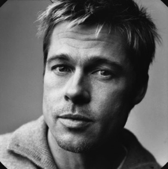

I am a Software Developer/Engineer who never knows whether
to call himself a Developer or Engineer. Engineer sounds better,
so let's go with Developer.

I live in Brisbane, Australia, where I work for
[Stacktrace](https://stacktracehq.com). My current day-to-day is
working with C#/dotnet and Angular, deployed on Azure. I have mixed
feelings about this.

I have built software for several industries, using a slew of
languages, frameworks, and tools. To the extent that I can
enjoy things, I enjoy building useful software as simply as possible.
In my experience this is unreasonably hard to do. If you have magic
beans, I will buy them. Something, something, Mircoservices.

I've gone on a functional programming journey in the past couple of years.
I believed I was reaching a summit, but apparently I'm still in my
driveway, at the bottom of a hill beneath a bus stop, where I can catch
a bus to the airport and get a plane to where the mountain actually is.
I miss my family.

If you must, you can find me on:

* [GitHub](https://github.com/beeleebow)
* [LinkedIn](https://www.linkedin.com/in/brad-bow-0b337a35/)

I'm not on Twitter or Facebook and am generally weary of people,
places, and things.

