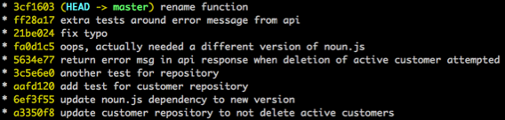
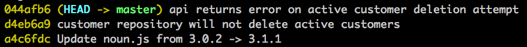

# TL;DR

Your **Git history is a story** and your commits are the major plot points. Rewriting your Git history keeps your story **free from triviality and irrelevant distraction**. Taking a more disciplined approach to structuring your commits can also **improve the PR process** by adding a narrative arc that the reviewer can follow and large PRs are made easier when you can work through them a commit at a time. You may even find that remaining Git-aware encourages a helpful amount of forethought that results in **better-structured, cleaner code**.

## I can change history?

In case you're not aware, Git allows you to rewrite your history. You can squash changes together or split them apart. You can re-order the sequence of commits or change their commit messages. All things, it seems, are possible.

But isn't the idea of rewriting the history of your version control system at odds with it's purpose? After all, it's meant to be a record of all the changes that occurred. Even though you _can_ do this, why _would_ you?

Well, sometimes you **definitely shouldn't**. Throughout the rest of the post keep the following in mind:

> **DISCLAIMER**: Any branch that tracks a remote branch which multiple people pull from or push to (e.g. master, develop, shared feature branches) should **not** have it's history rewritten. If you rewrite history on these branches it will **cause your issues for the people you are collaborating with**.

That disclaimer dealt with, if we limit our discussion to just your local Git workflow, or a feature branch that is just being pulled from/pushed to by you, then here are some reasons to consider rewriting your Git history.

## Your mistakes are historically insignificant

I don't know about you, but my days at work usually go something like this:

* Arrive at work
* Cry briefly
* Start coding
* Make several mistakes that I **do not yet recognise as mistakes**
* Continue coding
* Fix one or two of the now obvious mistakes
* Be disappointed with my lunch choice
* Continue coding, confident there could be no more mistakes
* **Spend the rest of the afternoon fixing mistakes**

I'm willing to bet your day has its fair share of mistakes in it as well. I'd love to think that I will one day be entirely competent and mistake free, but all evidence suggests that I will continue to make mistakes.

That doesn't mean that these mistakes have to be immortalized and remembered for all of time though. If you commit often throughout your mistake-filled days then you are probably going to end up with a commit history like this:

This is definitely honest. There are all your mistakes, right out in the open for the everyone to see. What is to be gained from this honesty though? Noise and distraction, it seems. If your Git history is a story, then the history above is a 3 hour epic filled with distracting plot deviations.

Just like your source code, the commit history will be read more than it is written. It makes sense then, that you should optimise for this purpose. There is a level of subjectivity to what "readable" is, but here are some of my suggestions:

* **Non-Trivial**: No commits for typo fixes or small refactorings.
* **Well-Sized**: This is subjective and will vary from team to team. At the very least steer away from the mammoth commit that changes all the things.
* **Cohesive**: All the changes in the commit obviously belong together. Don't introduce a UI validation function and the logging of unrelated database access in the same commit. The use of the word "and" in your commit message can indicate you've bundled unrelated changes together.
* **Builds and passes tests**: Every commit should be complete enough that you should be able to check it out, build it, and have all the tests pass. This is less important if you use a feature branch workflow where you squash on merge to your long lived branches.
* **Has an honest commit messages**: After reading the commit message you are not _surprised_ by any of the changes that are in the commit.

The beautiful thing about Git is that once we have finished our work and corrected our mistakes we can rewrite the history to express the successful end state and exclude our irrelevant whoopsy-daisies. Sticking with our example, we could move from the noisy history above to something like this:

We've cut the plot points back to the bare minimum required for our story to make sense. This has the added benefit of making us look much better than we actually are come peer review time.

## PRs are easier if there is a well-structured story

Humans learn best through stories. It's hard wired into us. When it comes to PRs the most powerful story telling mechanism we have are the commits.

Commits allow us to express chronology (I did this, _then_ I did this). Most of the time, the later commits will depend on the earlier commits. This is useful information for a reviewer and helps to place any particular change in a wider story arc.

Reviewing by commit also allows us to digest a large PR in small bites. This allows a time poor reviewer to do a PR over a couple of days, because they can easily pick up where they left off the day before (though I recommend striving for small PRs that are quickly actioned).

## Being Git-aware helps you plan your work

Planning has become something of a taboo in recent years. Sometimes it seems that your job as a developer is to open up your editor/IDE and start typing. If you aren't cutting code, then you aren't working. This mentality is evident in most of the commit histories I see. They are filled with the tell-tale trivial commits that serve as evidence that the typing and the problem solving were occurring at the same time.

I have found that remaining Git-aware as I work has seen me spend more time planning my approach to a feature or bug fix. I spend time thinking about the changes I will need to make and the new components/classes/functions I may need to introduce. As I am laying this out, usually in a simple bullet point format, I am thinking about how to craft commits that tell this story to my reviewer in the clearest possible way.

